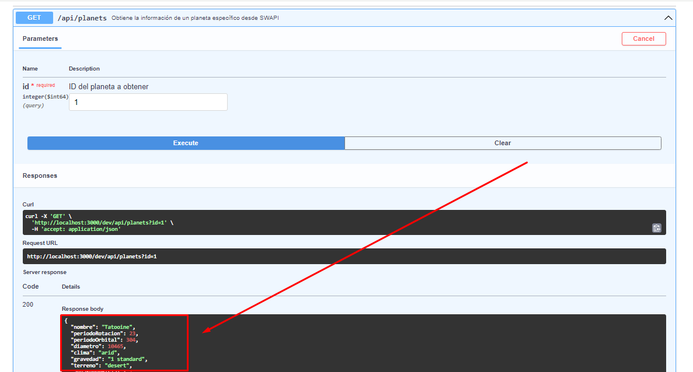
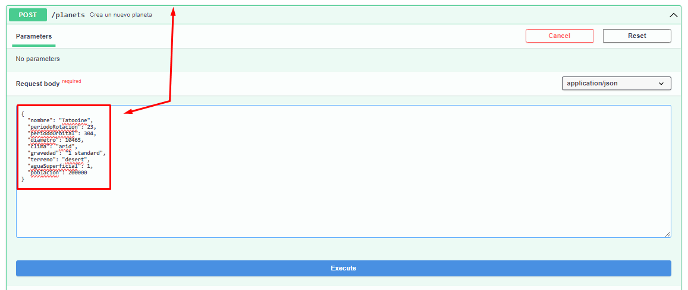
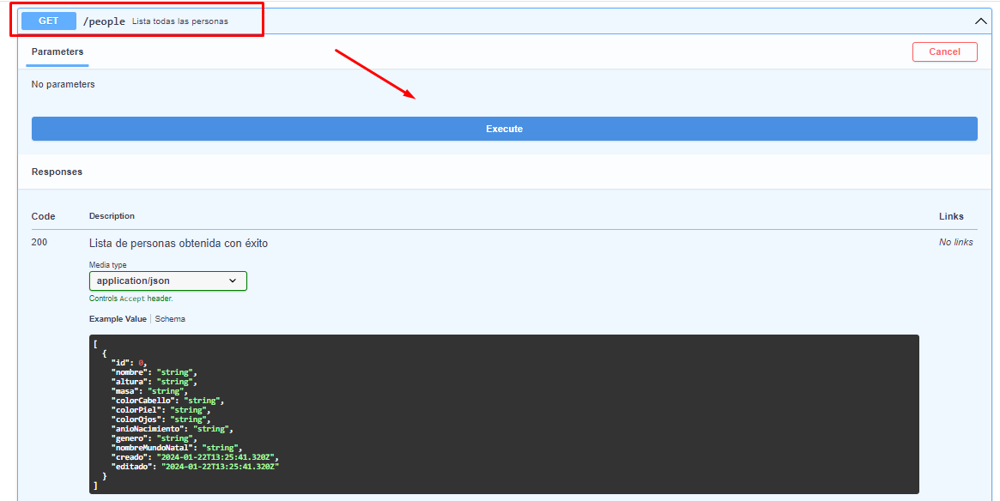
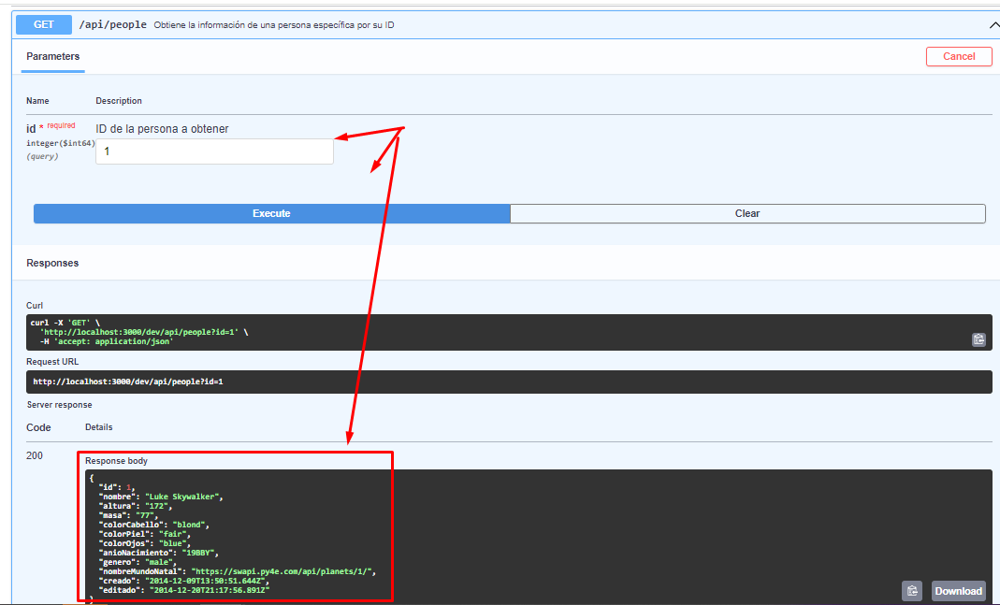
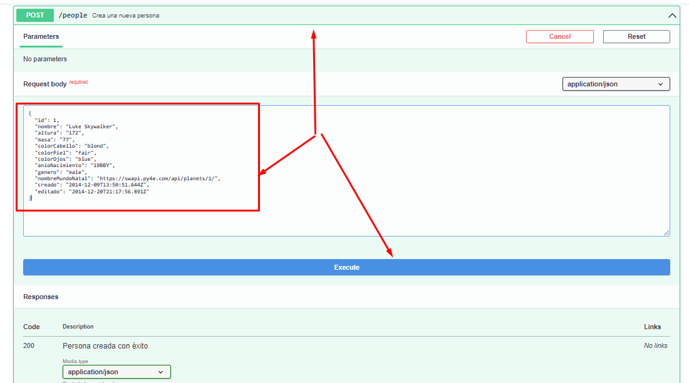
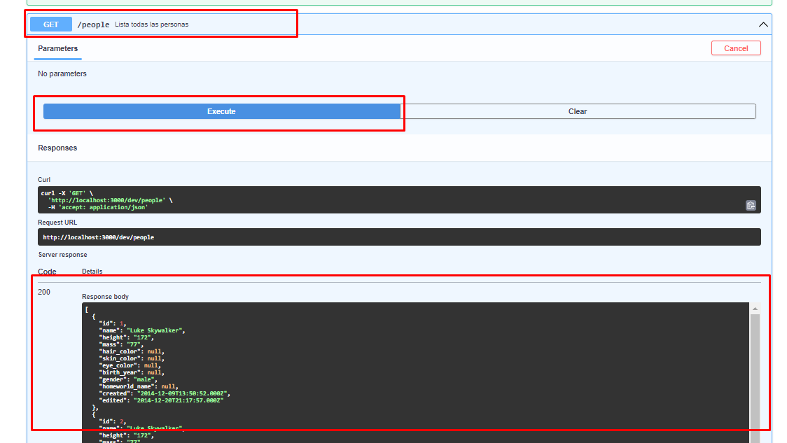

# Proyecto -SWars API
La SWars API te permite interactuar con datos relacionados con el universo de Star Wars, específicamente con información de planetas y personas. Esta API está diseñada para ser sencilla y fácil de usar.


**Arquitectura y Patrones de Diseño**:  
Los servicios se han implementado siguiendo una arquitectura hexagonal y los principios de Domain-Driven Design (DDD), lo que facilita una clara separación entre la lógica del negocio y las interacciones externas. Utiliza Command Query Responsibility Segregation (CQRS) para diferenciar entre las operaciones de lectura y escritura, lo que mejora la escalabilidad, trazabilidad y la capacidad de auditoría del sistema.
 


#### **UI/API [Adaptadores Primarios]** - [1] 
**Función**: Interfaz de usuario y puntos de entrada de la API.  
**Componentes**: Controladores o resolvers (src/app/controllers), Rutas (src/app/hamdler).  
**Descripción**: Gestiona las solicitudes entrantes de los usuarios o sistemas externos y las redirige a la capa de aplicación.

#### **Capa de Aplicación [Puerto Primario]** - [2]
**Función**: Orquestación de la lógica de aplicación.  
**Componentes**: Servicios (src/app/services), Configuraciones generales (src/app).  
**Descripción**: Coordina los casos de uso, procesando datos y lógica de negocio, y los envía a la capa correspondiente.

#### **Casos de Uso [Controladores de Lógica de Negocio]** - [3]
**Función**: Manejo específico de casos de uso de la lógica de negocio.  
**Componentes**: Módulos de casos de uso (src/contexts/transaction/application).  
**Descripción**: Implementa la lógica específica de los casos de uso, como procesos de transacción, validaciones y reglas de negocio.

#### **Capa de Dominio [Núcleo]** - [4]
**Función**: Núcleo de la lógica de negocio.  
**Componentes**: Entidades y lógica de dominio (src/contexts/transaction/domain).  
**Descripción**: Contiene la lógica de negocio esencial y las reglas del dominio, modelando los objetos y procesos del negocio.

#### **Puertos Secundarios [Interfaces de Dominio]** - [5]
**Función**: Interfaces para la comunicación externa.  
**Componentes**: Interfaces de dominio (src/contexts/shared/domain).  
**Descripción**: Proporciona puntos de integración y comunicación con sistemas externos o con la capa de infraestructura.

#### **Capa de Infraestructura [Adaptadores Secundarios]** - [6]
**Función**: Implementaciones técnicas y de soporte.  
**Componentes**: Implementaciones de infraestructura (src/contexts/transaction/infrastructure).  
**Descripción**: Maneja las operaciones de persistencia, conexiones a bases de datos y la interacción con servicios externos.

#### **Recursos Compartidos [Shared Kernel]** - [7]
**Función**: Código y funcionalidades comunes.  
**Componentes**: Código compartido (src/contexts/shared).  
**Descripción**: Incluye herramientas, utilidades y código que es compartido entre diferentes partes del sistema, proporcionando una base común y reduciendo la duplicidad.


## Comenzando


# Prerrequisitos para Configurar y Ejecutar el Proyecto Serverless
Antes de hacer cualquier solicitud a la API, asegúrate de tener las credenciales adecuadas y permisos para acceder a los servicios AWS.

Antes de clonar y ejecutar el proyecto, debes tener configurado lo siguiente en tu entorno de desarrollo:

## Herramientas Requeridas

- **AWS CLI:** Debes tener la AWS Command Line Interface instalada y configurada con tus credenciales.
- **Node.js:** Se requiere Node.js, preferiblemente la versión 18.x ya que es la que se utiliza en el runtime de AWS Lambda.
- **Serverless Framework:** Debes tener el Serverless Framework instalado globalmente en tu máquina. Puedes instalarlo con `npm install -g serverless`.
- **Prisma:** Si el proyecto usa Prisma, asegúrate de que está instalado y configurado adecuadamente en tu entorno.

## Configuración de AWS

- **SSM Parameters:** Asegúrate de que las siguientes variables de entorno están configuradas en el AWS Systems Manager Parameter Store (SSM):
  - `DATABASE_URL`: URL de conexión a tu base de datos.
  - `SWAPI_BASE_URL`: URL base para la Star Wars API (SWAPI).

## Variables de Entorno

- Configura las variables de entorno locales necesarias para la ejecución del proyecto. Puedes hacerlo creando un archivo `.env` en la raíz de tu proyecto con el siguiente contenido:

```plaintext
DATABASE_URL=your_database_connection_string_here
SWAPI_BASE_URL=https://swapi.py4e.com
```
  
## Uso

```bash
 
# Clonar el repositorio
git clone https://github.com/sistemas0011ff/servlees-swap.git

# Cambiar al directorio del proyecto
cd servlees-swap

# Instalar las dependencias del proyecto
npm install

# Desplegar el proyecto en AWS
serverless deploy
```

## Endpoints de la API

### Planetas

#### Obtener un Planeta por ID

- **Endpoint:** `GET /api/planets`
- **Descripción:** Devuelve los detalles de un planeta específico basado en el ID proporcionado desde swapi.py4e.com.
Este resultado deberá ser utilizado para crear un nuevi recurso
- **Parámetros de Consulta:**
  - `id`: ID del planeta a recuperar.





#### Crear un Nuevo Planeta

- **Endpoint:** `POST /planets`
- **Descripción:** Crea un nuevo registro de planeta con los datos proporcionados en el cuerpo de la solicitud de la consulta al api externa.


#### Listar todos los Planetas

- **Endpoint:** `GET /planets`
- **Descripción:** Obtiene una lista de todos los planetas registrados.




### Personas

#### Obtener una Persona por ID

- **Endpoint:** `GET /api/people`
- **Descripción:** Devuelve los detalles de una persona específica basado en el ID proporcionado desde swapi.py4e.com, este resultado tenemos que copiarlo en el input en el endpoint de creación de nuevo registro.
- **Parámetros de Consulta:**
  - `id`: ID de la persona a recuperar.




#### Crear una Nueva Persona

- **Endpoint:** `POST /people`
- **Descripción:** Crea un nuevo registro de persona con los datos proporcionados en el cuerpo de la solicitud, acá se deberá pegar el resultado de la consulta de la api externa que ya esta traducido al español sus atributos



#### Listar todas las Personas

- **Endpoint:** `GET /people`
- **Descripción:** Obtiene una lista de todas las personas registradas.


 

### Autor

- **Arturo Eduardo Fajardo Gutiérrez** 

